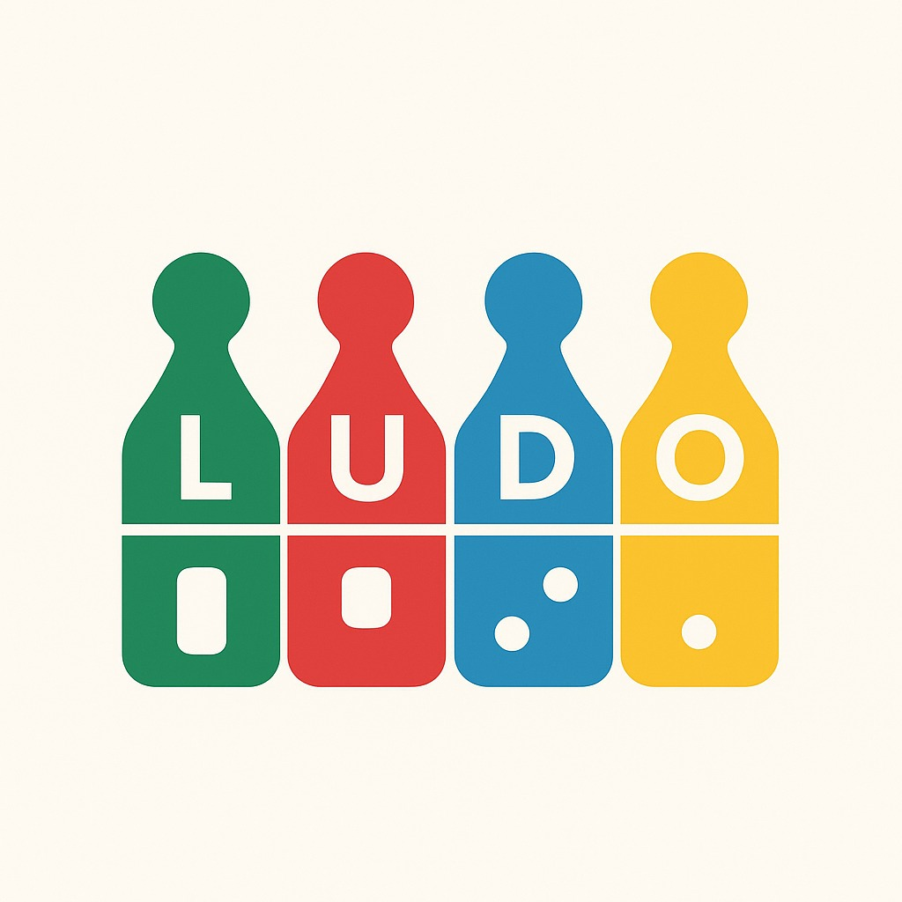

# 🎲 Mini Ludo

Este es un proyecto simple de un juego de Ludo (Parqués) a nivel de consola y con una interfaz gráfica (GUI) básica implementada con Java Swing. El juego simula una carrera de dos jugadores en un tablero lineal de 20 casillas.

## Características del Juego

* **Juego para 2 jugadores:** Controlados por turnos en una misma interfaz.
* **Tablero Lineal:** Recorrido simple de 20 casillas.
* **Dado Estándar:** Generación de números aleatorios del 1 al 6.
* **Regla de Choque (Simple):** Si la ficha de un jugador cae exactamente en la posición de la ficha del otro, la ficha del jugador chocado regresa a la posición 0.
* **Meta:** El primer jugador en alcanzar o superar la casilla 19 (la casilla 20 no se usa, la meta es en `longitud - 1` del Tablero de 20) gana.
* **Interfaz Gráfica:** Implementada con `JFrame` y varios `JPanel`s usando `BorderLayout` y `BoxLayout` para la organización.

## Cómo Ejecutar el Proyecto

Este proyecto está escrito en **Java** y usa **Swing** para la interfaz gráfica.

### Requisitos

* Java Development Kit (JDK) 8 o superior.
* Un IDE como IntelliJ IDEA, Eclipse o VS Code con soporte para Java.

### Instrucciones de Ejecución

1.  **Clonar el Repositorio:**
    ```bash
    git clone [https://docs.github.com/es/repositories/creating-and-managing-repositories/quickstart-for-repositories](https://docs.github.com/es/repositories/creating-and-managing-repositories/quickstart-for-repositories)
    ```
2.  **Abrir en tu IDE:** Importa la carpeta del proyecto como un proyecto Java.
3.  **Ejecutar:** Localiza el archivo `JuegoGUI.java` y ejecuta el método `main`. La interfaz gráfica se iniciará automáticamente.

## Estructura del Código

El código está organizado en varias clases que representan los componentes básicos del juego de mesa:

| Archivo | Descripción | Clases Clave |
| :--- | :--- | :--- |
| `JuegoGUI.java` | **Interfaz Gráfica.** Configura el `JFrame` (ventana), los `JLabels` (posiciones, tablero) y el `JButton` ("Tirar Dado"). Contiene la lógica principal de la actualización visual. | `JuegoGUI` |
| `Juego.java` | **Lógica del Juego (Backend).** Maneja el estado actual del juego, los turnos (`turnoJ1`), y coordina las acciones entre los jugadores, el dado y el tablero. | `Juego` |
| `Jugador.java` | Representa a un jugador. Contiene el nombre y la ficha asociada. Implementa el método `jugarTurno()`. | `Jugador` |
| `Ficha.java` | Representa la pieza del jugador. Maneja la posición actual y la lógica de movimiento (`mover`) y reinicio (`reiniciar`). | `Ficha` |
| `Dado.java` | Un generador simple de números aleatorios del 1 al 6. | `Dado` |
| `Tablero.java` | Define la longitud del recorrido y verifica si una posición es la meta. | `Tablero` |

---

## Icono del Proyecto

El proyecto utiliza una imagen simple de fichas de Ludo como icono de la ventana.


